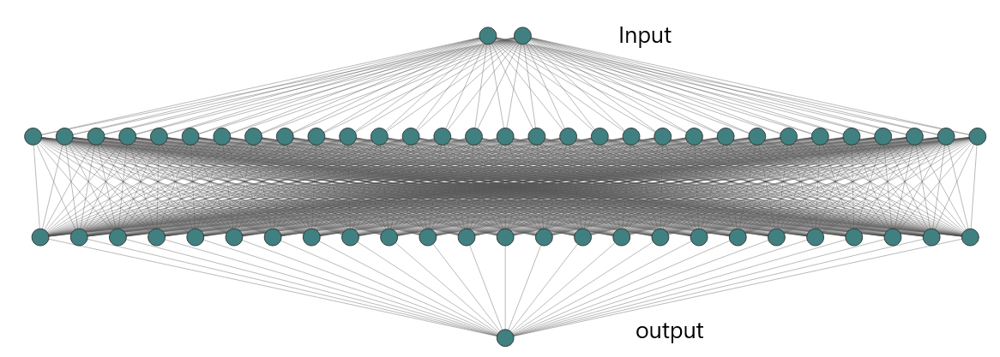

[Link Text]()

To solve the equation $x^2 + 2x + 1 = 0$, we can apply the quadratic formula or factor the equation.

Using the quadratic formula: 

To solve the equation $x^2 + 2x + 1 = 0$, we can apply the quadratic formula or factor the equation.

Using the quadratic formula: 

where $a=1$, $b=2$, and $c=1$ in this case.

Substituting these values into the formula, we get:

Since the discriminant is zero, we have one real root using the quadratic formula.

Therefore, the solution to the equation $x^2 + 2x + 1 = 0$ is:

$\displaystyle x=-1$

Hence, the answer is $\boxed{x=-1}$.

# Introduction

Good visualization of back propagation is available in this [blog post](https://developers-dot-devsite-v2-prod.appspot.com/machine-learning/crash-course/backprop-scroll). Please watch Grant Sanderson's video on [Neural Networks](https://www.youtube.com/watch?v=aircAruvnKk&list=PLrfgFTEf_n9bb3kpuvxdZdTSUCv0qfyPD) to develop good intuition. Christopher Olah's highly influential [blog posts](https://colah.github.io/) might also help improve understanding of neural networks.

Over time, python frameworks evolved and capitalized on new advancements in hardware design, making developers' lives a little easier. Still, there is a lot of room for improvement. For now, we focus our attention on machine learning research and stick with Python.

Training neural networks requires data (a lot of it), and performing a large number of numerical operations. Writing naive code increases time and space complexities. Occasionally, researchers come up with effective linear algebra libraries and numerical techniques. Several frameworks to take advantage of hardware architecture for large-scale deployment of new ideas are under active development. So, we encourage students to persistently explore the landscape and educate themselves with libraries like JAX and Parallel computing libraries like PyOMP. 

For developers who rely on Intel processors, Intel One API provides several native optimizations that require just changing the python interpreter. Nvidia users may find cuNumeric and Numba helpful. Knowledge of any of your favorite optimization libraries may be a highly desirable job skill!

In this tutorial, which is followed by the accompanying Project for this week, we focus on the fundamentals of the training and testing processes.

# A tutorial on training and testing neural networks

In this tutorial the goal is to understand how to set up and train a neural network to approximate labeled samples. Please download the jupyter notebook from \cite{Project_Jupyter_Notebook}.

In the example jupyter notebook, we first show how to create samples that are later used to train and evaluate the neural network approximation.

Consider the function,

\[ f(x_1, x_2) = x^2_{1} + x^2_{2} \]

We call \(x_1\) and \(x_2\) features. The feature vector is

\[ 
x = \begin{bmatrix}
x_{1} \\
x_{2}
\end{bmatrix}.
\]

## Generate training samples and testing samples

Cell 4 in the jupyter notebook shows how to generate 500 training samples \(\{ (x^{(i)}, y^{(i)}) : 1 \leq i \leq m \}\), where each \(x^{(i)} \in \mathbb{R}^2\), and \(y^{(i)} = f(x^{(i)}_1, x^{(i)}_2) + v^{(i)} \in \mathbb{R}^1\).

The entries \(x^{(i)}_1, x^{(i)}_2\) of each vector \(x^{(i)}\) are randomly and independently chosen from \([-1, +1]\) according to a uniform distribution. The labels \(y^{(i)}\) are noisy values of \(f(x^{(i)}_1, x^{(i)}_2)\). The \(v^{(i)}\)'s are independent and identically distributed with distribution \(N(0, 0.01)\), i.e., normally distributed with mean 0 and variance 0.01.

Cell 4 also shows how to generate the test samples. No noise is added to the 50 test samples.

## Define a neural network stack

There are several ways of writing a neural network stack. Cells 7 and 17 in the jupyter notebook provide two different ways of defining a network.

The network defined has 2 input features, 2 neurons at level 1, and 1 neuron at level 2 which produces the output. The network is fully connected. This is shown in Figure 1.

Please note that there are a total of (2x2) weights +(2x1) weights + 3 biases = 9 parameters.

## Defining a loss function

The loss function we choose is average squared error: \(\frac{1}{m} \sum_{i=1}^m \left( y^{(i)} - \hat{y}(x_{(i)}, \theta) \right)^2\). Here \(m\) is the number of training samples. Cell 13 shows how to define the loss function.

## Train neural network

The gradient descent method is called "stochastic gradient method" in the literature, and abbreviated as SGD.

After defining the network stack Cell 25 shows a very simple way to train the network using backprop and gradient descent. The hyperparameters for momentum and learning rate are chosen in Cell 24.

Please note however that this is NOT the code used to actually train the network. That code is provided in Cell 32. The prior cells are only for simple illustrative purposes for your understanding. Please see Cell 32 for the actual code used for training as well as testing.

## Plotting the neural network training error

Please see Cell 36 on how to plot the training losses change as we continue to train.

## Evaluating neural network on test data

Please see Cell 31 to plot the performance of the trained system on the test data. Cell 36 also shows the performance on the test data as we continue to train.

### Magic of over-parameterization

There is an interesting empirical phenomenon called "double descent" that can sometimes be observed: A model with a small number of parameters and a model with an extremely large number of parameters have a small test error, but a model whose number of parameters is about the same as the number of data points used to train the model has a large test error. You can read more about this phenomenon in [Preetam et. al work](https://arxiv.org/abs/1912.02292) and [open AI blog post](https://openai.com/research/deep-double-descent).

We consider neural networks with a large number of neurons in Layer 1, as shown in Figure 2. Specifically we consider neural networks with 10 or 100 neurons in Layer 1. We repeat the training for each of these large neural networks which have many more parameters. In Cells 37, 43, 50, and 55 we plot the training and test performance of a neural network. Please see the very end of Cell 65 to see this "double descent" phenomenon.

# Project Assignment

Now we come to the project that you are assigned to do this week. It consists of one problem, carrying 100 points.

What was provided above was only snippets to help you understand. Please write your own code after assimilating the above explanatory material.

**Problem:**

- Let \(f(x_1, x_2, x_3, x_4) := x^2_1 + x^2_2 + 2x^3_3 + 4x^3_4\). It consists of 4 inputs \(x_1, x_2, x_3, x_4\) and one output. Generate training samples by adding independent normally distributed noise of mean 0 and variance 0.01. Create a dataset consisting of 500 training samples with all \(x_i \in [-1, 1]\), and 50 noiseless test samples with all \(x_i \in [-2, -1] \cup [1, 2]\).
- Train a small neural network of shape (2, 1). The four inputs are completely connected to the two RELU neurons at layer 1. These two neurons are connected to a linear output neuron.
- Break the 500 training samples into five minibatches each containing 100 labeled samples. (This is a new detail not present in the above tutorial). Plot the learning performance over 25 episodes, where in each episode all the five minibatches are used once in order.
- Train 5-10 different neural networks that have 10s, 100s, and 1000s of parameters.
- Plot the training and test performances of all networks.
- Summarize all your observations.
- In the summary, mention if you've observed the double descent phenomenon.

---

