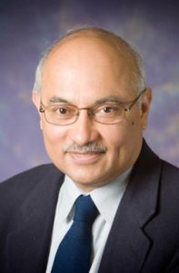

  

    <h2>ECEN 740 TAMU: Machine Learning </h2>
    <h3> Course Instructor: Prof. P R Kumar </h3>
    <h3> <a href="https://cesg.tamu.edu/faculty/p-r-kumar/">Lab Webpage</a> </h3>
    
  

  <figure style="margin-left: auto;">
    
  </figure>

---
### Course Description
First level graduate course on Machine Learning.
Emphasis on fundamental theory for learning supervised classification/regression models
covers Bayes classifier, maximum-likelihood estimation, least squares, Probably Approximately Correct Learning, empirical risk minimization, Vapnik-Chervonenkis Dimension, computational learning, structural risk minimization, regularization, cross-validation, acyclic feedforward networks, completeness of neural networks, backpropagation algorithm, gradient descent, stochastic gradient descent, Convolutional Neural networks, Auto-encoders, Generative Adversarial Networks, support vector machines, kernel-based methods, learning from experts, boosting, Gaussian process- based learning, word embeddings, recurrent neural networks, decision trees, random forests, nearest neighbor classification, seq2seq models, NLP, attention mechanisms, BERT, GPT.

---
### Pre-requisites

1. Basic Probability Theory
2. Linear Algebra fundamentals
3. Calculus
4. Quick overview of Convex Optimization
5. Hands on Python
6. Use of high performance computing resources: HPRC/Google Colab/Department Clusters

---

#### Course Pre-requisites
ECEN 303 or MATH 411 or STAT 614 or STAT 615 or by Professor approval.

---
### References

Shai Shalev-Shwartz and Shai Ben-David, Understanding Machine Learning: From Theory to Algorithms, Cambridge University Press, 2014.

